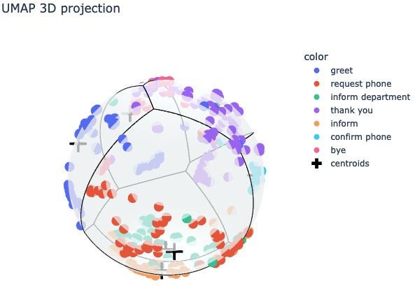
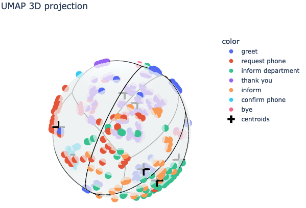
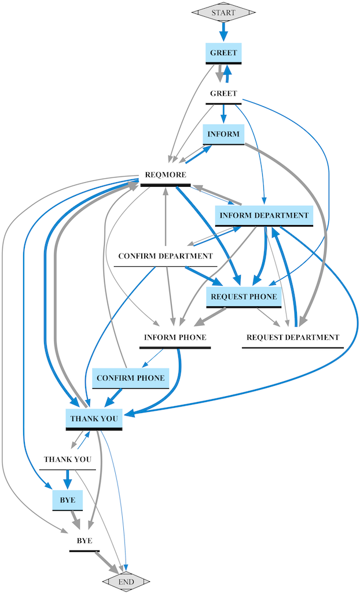

# Paper Replication

This section described how to replicate the quantitative and qualitative experimentation described in the original paper.

## 0. Getting started

In case you want to replicate the results obtained with OpenAI `text-embedding-3-large` model, do not forget to add your OpenAI API key to your current environment variables:
```bash
export OPENAI_API_KEY=<YOUR_API_KEY_HERE>
```
Additionally, in case you want to include the baseline models D2F-Hard$_{single}$, D2F-Hard$_{joint}$ and SBD-BERT to the results:

1. Download and unzip the ["models.zip"](https://drive.google.com/file/d/1-Ikxf8ImzTXZ73ewmIJHQ4SiGSw6_Ojv/view?usp=sharing) file in the root directory, after unzipping you should have the following structure:
    ```
    - dialog2flow/
        +- data/
        +- misc/
        |- models/
        |   |- d2f-hard_joint/
        |   |- d2f-hard_single/
        |   |- todbert_sbd/
        +- train/
        ...
    ```
2. Now, uncomment the lines marked with "`------> (UNCOMMENT line if already unzipped)`" in the following two bash scripts:
    - `evaluate_embeddings.sh`
    - `evaluate_graphs.bash.bash`

That's it! everything ready to begin replicating the experiments! :)


## 1. Similarity-based Evaluation (Section 6)

The `evaluate_embeddings.sh` bash script will take care of running the evaluation on each model and show the results at the end. To run in just simply pass the name of the evaluation set to use, as follows:

1. Results on the unified TOD evaluation set (Table 2 and 4):
    ```bash
    bash evaluate_embeddings.sh unified_evaluation
    ```
2. Results on SpokenWOZ (Table 3 and 4):
    ```bash
    bash evaluate_embeddings.sh spokenwoz
    ```
After scripts finish running, all results are saved in `output/results/DATASET_NAME` so they can be printed anytime without the need to re-compute them again, using the ``script as follows:
1. Results on the unified TOD evaluation set (Table 2 and 4):
    ```bash
    python show_embedding_results.py -i "output/results/unified_evaluation"
    ```
2. Results on SpokenWOZ (Table 3 and 4):
    ```bash
    python show_embedding_results.py -i "output/results/spokenwoz"
    ```

For instace, the output for the unified TOD evaluation set should look something like this:
```
=============== CLASSIFICATION RESULTS ===============
| model                                   | 1-shot f1    | 5-shot f1    | 1-shot accuracy   | 5-shot accuracy   |   intra-anisotropy |   inter-anisotropy |   intra-inter delta |
|:----------------------------------------|:-------------|:-------------|:------------------|:------------------|-------------------:|-------------------:|--------------------:|
| dialog2flow-single-bert-base            | 64.54 ± 0.82 | 71.30 ± 0.76 | 67.36 ± 0.76      | 74.51 ± 0.56      |              0.757 |              0.186 |               0.572 |
| dialog2flow-joint-bert-base             | 62.98 ± 0.68 | 71.17 ± 0.75 | 65.95 ± 0.64      | 74.28 ± 0.65      |              0.734 |              0.289 |               0.444 |
| d2f-hard_single                         | 58.21 ± 0.74 | 68.54 ± 0.82 | 61.11 ± 0.65      | 71.26 ± 0.61      |              0.65  |              0.313 |               0.337 |
| d2f-hard_joint                          | 55.20 ± 1.12 | 66.69 ± 1.14 | 58.04 ± 0.99      | 69.67 ± 1.01      |              0.638 |              0.399 |               0.239 |
| dse-bert-base                           | 34.60 ± 0.76 | 43.25 ± 1.15 | 37.41 ± 0.90      | 47.59 ± 1.05      |              0.652 |              0.541 |               0.111 |
| space-2                                 | 26.93 ± 0.64 | 37.04 ± 0.66 | 28.95 ± 0.62      | 41.32 ± 0.57      |              0.664 |              0.646 |               0.018 |
| DialoGPT-medium                         | 25.47 ± 0.75 | 32.64 ± 0.65 | 27.83 ± 0.70      | 36.81 ± 0.52      |              0.735 |              0.758 |              -0.023 |
| bert-base-uncased                       | 23.33 ± 0.57 | 28.64 ± 0.77 | 26.00 ± 0.63      | 33.09 ± 0.78      |              0.742 |              0.781 |              -0.039 |
| text-embedding-3-large                  | 32.11 ± 0.86 | 41.09 ± 0.69 | 34.92 ± 0.83      | 45.55 ± 0.62      |              0.541 |              0.424 |               0.117 |
| all-mpnet-base-v2                       | 27.34 ± 0.60 | 34.02 ± 0.84 | 30.08 ± 0.57      | 38.63 ± 0.74      |              0.507 |              0.333 |               0.173 |
| gtr-t5-base                             | 29.89 ± 0.74 | 38.67 ± 0.49 | 32.55 ± 0.80      | 43.21 ± 0.45      |              0.694 |              0.706 |              -0.012 |
| todbert_sbd                             | 23.99 ± 0.56 | 27.66 ± 0.80 | 25.99 ± 0.65      | 31.57 ± 0.57      |              0.685 |              0.604 |               0.081 |
| average_word_embeddings_glove.840B.300d | 23.10 ± 0.68 | 24.11 ± 0.50 | 26.00 ± 0.63      | 29.59 ± 0.71      |              0.669 |              0.633 |               0.036 |
| TOD-BERT-JNT-V1                         | 26.77 ± 0.54 | 33.82 ± 0.67 | 28.90 ± 0.59      | 37.54 ± 0.50      |              0.847 |              0.864 |              -0.017 |


=============== RANKING RESULTS ===============
| model                                   | NDCG@10      |
|:----------------------------------------|:-------------|
| dialog2flow-single-bert-base            | 67.30 ± 0.41 |
| dialog2flow-joint-bert-base             | 66.51 ± 0.50 |
| d2f-hard_single                         | 60.86 ± 0.47 |
| d2f-hard_joint                          | 58.39 ± 0.71 |
| dse-bert-base                           | 38.09 ± 0.71 |
| space-2                                 | 30.01 ± 0.47 |
| DialoGPT-medium                         | 28.86 ± 0.71 |
| bert-base-uncased                       | 26.97 ± 0.80 |
| text-embedding-3-large                  | 35.76 ± 0.62 |
| all-mpnet-base-v2                       | 30.89 ± 0.69 |
| gtr-t5-base                             | 33.21 ± 0.60 |
| todbert_sbd                             | 27.20 ± 0.83 |
| average_word_embeddings_glove.840B.300d | 26.53 ± 0.56 |
| TOD-BERT-JNT-V1                         | 30.54 ± 0.74 |
```
_(Note that there could be some minor difference due to results being the average of running 10 experiments sampling different instances each time)_

### 1.1. 3D Voronoi Plots (as in Figure 3)

We provide the `voronoi_plot.py` python script to generate the interactive 3D Vonoroi plots, as the ones shown in Figure 3.
More precisely, this script takes as input (1) the path to the `trajectories.single_domain.json` file of the dataset (which contains, for each domain, the list of dialogs with their utterances and ground truth annotation, as explained in the last section of this README file), (2) the model to use to compute the embeddings, (3) the output path to store the plots, and (3) the domain of the dataset to use, if not provided, all domains by default. More preciselly, the script can be called as follows:
```bash
python voronoi_plot.py -i GROUND_TRUTH_TRAJECTORIES_PATH \
                       -m MODEL \
                       -o OUTPUT_PATH \
                       -d DOMAIN
```
For example, let's generate the plot with the [`dialog2flow-joint-bert-base`](https://huggingface.co/sergioburdisso/dialog2flow-joint-bert-base) model (D2F$_{joint}$ in the paper) for the `hospital` domain in SpokenWOZ:
```bash
python voronoi_plot.py -i data/spokenwoz/trajectories.single_domain.json \
                       -m "sergioburdisso/dialog2flow-joint-bert-base" \
                       -o "output/plots/voronoi/d2f_joint" \
                       -d hospital
```
The output are interactive visualizations saved HTML files, one of each speaker in the provided output path as `output/plots/voronoi/d2f_joint/DOMAIN/voronoi_SPEAKER.html`, for instance, for the above example, the file `output/plots/voronoi/d2f_joint/hospital/voronoi_user.html` (online version [here](http://tworld.io/extra/dialog2flow_example/voronoi_user_dialog2flow-joint-bert-base.html)) contains the plot for the user utterances of the selected `hospital` domain, which should look like this one:



Let's suppose now we want to generate the same plot but using OpenAI `text-embedding-3-large` model to compare results with the above, then we can simply change only the model name and the output folder name, as follows:
```bash
python voronoi_plot.py -i data/spokenwoz/trajectories.single_domain.json \
                       -m "openai/text-embedding-3-large" \
                       -o "output/plots/voronoi/openai" \
                       -d hospital
```
and look for the same file inside the new output folder, `output/plots/voronoi/openai/hospital/voronoi_user.html` (online version [here](http://tworld.io/extra/dialog2flow_example/voronoi_user_openai-text-embedding-3-large.html)), which should look like this one:




## 2. Dialog Flow Extraction Evaluation (Section 7)

To replicate the dialog flow extraction evaluation, we have prepared a special bash script, `evaluate_graphs.bash.bash`, to take care of it.
This script execute the following steps:
1. For each different embedding model, calls `extract_trajectories.py` to convert all the dialogs into trajectories by clustering their utterances (embeddings).
2. Calls `build_graph.py` to build the ground truth graphs for SpokenWOZ using its ground truth trajectories file (data/spokenwoz/trajectories.single_domain.json).
3. Calls `build_graph.py` again to build the graphs for all the trajectories files generated in the first steps with each model.
4. Calls `evaluate_graph.py` to evaluate the extracted graphs (step 3) against the ground truth graphs (step 2), and print the results, as in Table 6.

Thus, simply call this bash script:
```bash
bash evaluate_graphs.bash.bash
```
The output should look like this:
```
| MODEL                                   | taxi (31)    | police (23)   | hospital (18)   | train (49)   | restaurant (59)   | attraction (45)   | AVG.   |
|:----------------------------------------|:-------------|:--------------|:----------------|:-------------|:------------------|:------------------|:-------|
| dialog2flow-single-bert-base            | 9.68% (+3)   | 4.35% (-1)    | 11.11% (-2)     | 2.04% (+1)   | 5.08% (-3)        | 8.89% (+4)        | 6.86%  |
| dialog2flow-joint-bert-base             | 3.23% (+1)   | 8.70% (-2)    | 5.56% (-1)      | 10.20% (-5)  | 23.73% (-14)      | 0.00% (0)         | 8.57%  |
| dialog2flow-single-dse-base             | 16.13% (+5)  | 8.70% (-2)    | 5.56% (-1)      | 6.12% (+3)   | 5.08% (-3)        | 20.00% (+9)       | 10.26% |
| dialog2flow-joint-dse-base              | 19.35% (+6)  | 13.04% (-3)   | 5.56% (-1)      | 20.41% (+10) | 3.39% (-2)        | 8.89% (+4)        | 11.77% |
| d2f-hard_single                         | 12.90% (-4)  | 26.09% (-6)   | 16.67% (-3)     | 10.20% (-5)  | 10.17% (-6)       | 15.56% (+7)       | 15.26% |
| d2f-hard_joint                          | 0.00% (0)    | 8.70% (-2)    | 33.33% (-6)     | 20.41% (-10) | 25.42% (-15)      | 13.33% (-6)       | 16.87% |
| dse-bert-base                           | 32.26% (-10) | 17.39% (-4)   | 33.33% (-6)     | 30.61% (-15) | 27.12% (-16)      | 26.67% (-12)      | 27.90% |
| space-2                                 | 32.26% (-10) | 30.43% (-7)   | 38.89% (-7)     | 18.37% (-9)  | 32.20% (-19)      | 33.33% (-15)      | 30.91% |
| DialoGPT-medium                         | 32.26% (-10) | 34.78% (-8)   | 22.22% (-4)     | 44.90% (-22) | 64.41% (-38)      | 51.11% (-23)      | 41.61% |
| bert-base-uncased                       | 54.84% (-17) | 30.43% (-7)   | 22.22% (-4)     | 46.94% (-23) | 59.32% (-35)      | 42.22% (-19)      | 42.66% |
| text-embedding-3-large                  | 54.84% (-17) | 47.83% (-11)  | 55.56% (-10)    | 42.86% (-21) | 49.15% (-29)      | 44.44% (-20)      | 49.11% |
| all-mpnet-base-v2                       | 54.84% (-17) | 43.48% (-10)  | 55.56% (-10)    | 57.14% (-28) | 50.85% (-30)      | 55.56% (-25)      | 52.90% |
| gtr-t5-base                             | 41.94% (-13) | 43.48% (-10)  | 66.67% (-12)    | 51.02% (-25) | 61.02% (-36)      | 53.33% (-24)      | 52.91% |
| todbert_sbd                             | 77.42% (-24) | 43.48% (-10)  | 38.89% (-7)     | 71.43% (-35) | 86.44% (-51)      | 86.67% (-39)      | 67.39% |
| average_word_embeddings_glove-840B-300d | 80.65% (-25) | 52.17% (-12)  | 55.56% (-10)    | 75.51% (-37) | 86.44% (-51)      | 80.00% (-36)      | 71.72% |
| TOD-BERT-JNT-V1                         | 74.19% (-23) | 78.26% (-18)  | 55.56% (-10)    | 85.71% (-42) | 83.05% (-49)      | 82.22% (-37)      | 76.50% |
```

As with the previous section, in case you want to print the results without having to re-build all the graphs, simply call the `evaluate_graph.py` script of the step 4 above, as follows:
```
python evaluate_graph.py -i "output/graph" -gt "output/graph/ground_truth"
```

### 2.1. Dialog Flow Figures (Figure 2, 4, A1, and A2)

We can use the `build_graph.py` that takes a trajectories JSON file and a domain as input, and generates and saves the graph in the provided output path, as follows:
```bash
python build_graph.py -i PATH/TO/INPUT/trajectories.json \
                      -o PATH/TO/SAVE/GRAPH \
                      -d DOMAIN
```
We can pass an extra special argument `-png` to tell this script to also generate a PNG image of the graph.
Therefore, to generate the image for the ground truth graph for the hospital domain shown in Figure 1, we can do:
```bash
python build_graph.py -i "data/spokenwoz/trajectories.single_domain.json" \
                      -o "output/graph_plot/ground_truth" \
                      -d hospital \
                      -png
```
which will save the desired PNG file in `output/graph_plot/ground_truth/hospital/graph.png`, which should look like:



Then, we can use the same script, passing the path the the trajectories.json file generated with model (located in `output/`) to generate the image of the graph for each model and domain we want, as:
```bash
python build_graph.py -i "output/trajectories-MODEL.json" \
                      -o "output/graph_plot/MODEL" \
                      -d DOMAIN
                      -png \
```


To make this easier, we also provide a bash script that will generate the plot for all the models and as well as the ground truth graph for any given domain, as follows:
```bash
bash generate_graphs_visualization.bash.bash DOMAIN
```
With this script we can simply generate the plots from the paper (Figure 4, A1 and A2) by running:
```bash
bash generate_graphs_visualization.bash.bash hospital
```
The plots are saved following the `output/graph_plot/MODEL/DOMAIN/graph.png` path structure. For example:
- Reference graph: `output/graph_plot/ground_truth/hospital/graph.png`
- D2F graph: `output/graph_plot/dialog2flow-joint-bert-base/hospital/graph.png`
- DSE graph: `output/graph_plot/dse-bert-base/hospital/graph.png`
- Sentence-BERT graph: `output/graph_plot/all-mpnet-base-v2/hospital/graph.png`
- OpenAI graph: `output/graph_plot/text-embedding-3-large/hospital/graph.png`


## SpokenWOZ ground truth trajectories

As mentioned in the paper, before creating the graph, dialogues are converted to trajectories by clustering the embeddings and using their cluster ids to replace each utterance in the dialog.
The ground truth trajectories are generated likewise, but instead of using the cluster ids, using the ground truth action annotation (dialog act + slots) from the dataset.
We already provide the ground truth trajectory for SpokenWOZ in this repo (located in `data/spokenwoz/trajectories.single_domain.json`).

However, in case you need to create this file again from scratch or to create the same file with other dataset, we also provide the  Python script `data/spokenwoz2trajectories.py` we used to convert the original SpokenWOZ dataset to the `trajectories.single_domain.json` file.

To generate again this file from scratch, follow the following steps:
1. Download the original [SpokenWOZ dataset](https://spokenwoz.github.io/SpokenWOZ-github.io/) train, dev and test set files and unzip them, for instance in the `data/my_spokenwoz` new folder, as follow:
    ```bash
    cd data

    wget https://spokenwoz.oss-cn-wulanchabu.aliyuncs.com/text_5700_train_dev.tar.gz -P my_spokenwoz
    tar -xvzf my_spokenwoz/text_5700_train_dev.tar.gz -C my_spokenwoz

    wget https://spokenwoz.oss-cn-wulanchabu.aliyuncs.com/text_5700_test.tar.gz -P my_spokenwoz
    tar -xvzf my_spokenwoz/text_5700_test.tar.gz -C my_spokenwoz
    ```
2. Now use the `spokenwoz2trajectories.py` script available in `data/` folder to convert the original SpokenWOZ files to the ground truth trajectories JSON file as follows:
    ```bash
    python spokenwoz2trajectories.py -i my_spokenwoz/
    ```

After this, the file `trajectories.single_domain.json` should've been created inside `data/my_spokenwoz/` folder (feel free to remove all the other files created inside this folder).


## Citation

If you found the paper and/or this repository useful, please consider citing our work: :blush::+1:

```bibtex
@inproceedings{burdisso-etal-2024-dialog2flow,
    title = "Dialog2Flow: Pre-training Soft-Contrastive Action-Driven Sentence Embeddings for Automatic Dialog Flow Extraction",
    author = "Burdisso, Sergio  and
      Madikeri, Srikanth  and
      Motlicek, Petr",
    booktitle = "Proceedings of the 2024 Conference on Empirical Methods in Natural Language Processing",
    month = nov,
    year = "2024",
    address = "Miami",
    publisher = "Association for Computational Linguistics",
}
```

## License

Copyright (c) 2024 [Idiap Research Institute](https://www.idiap.ch/).

MIT License.
