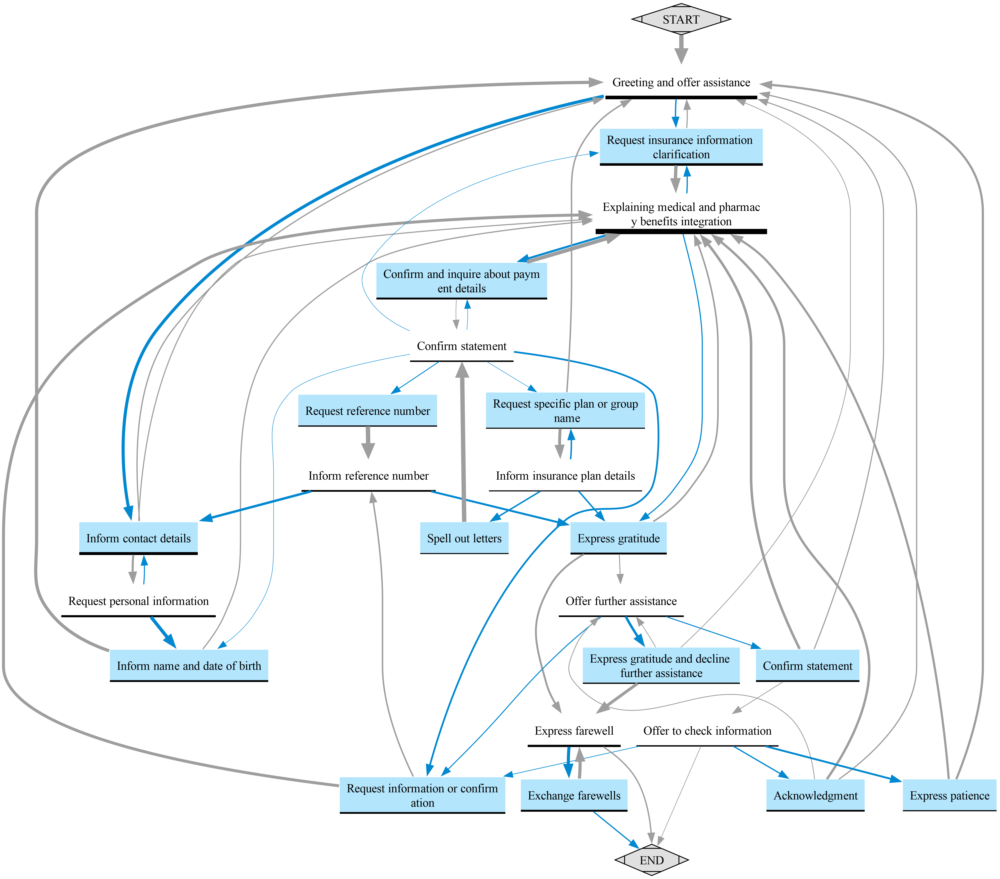
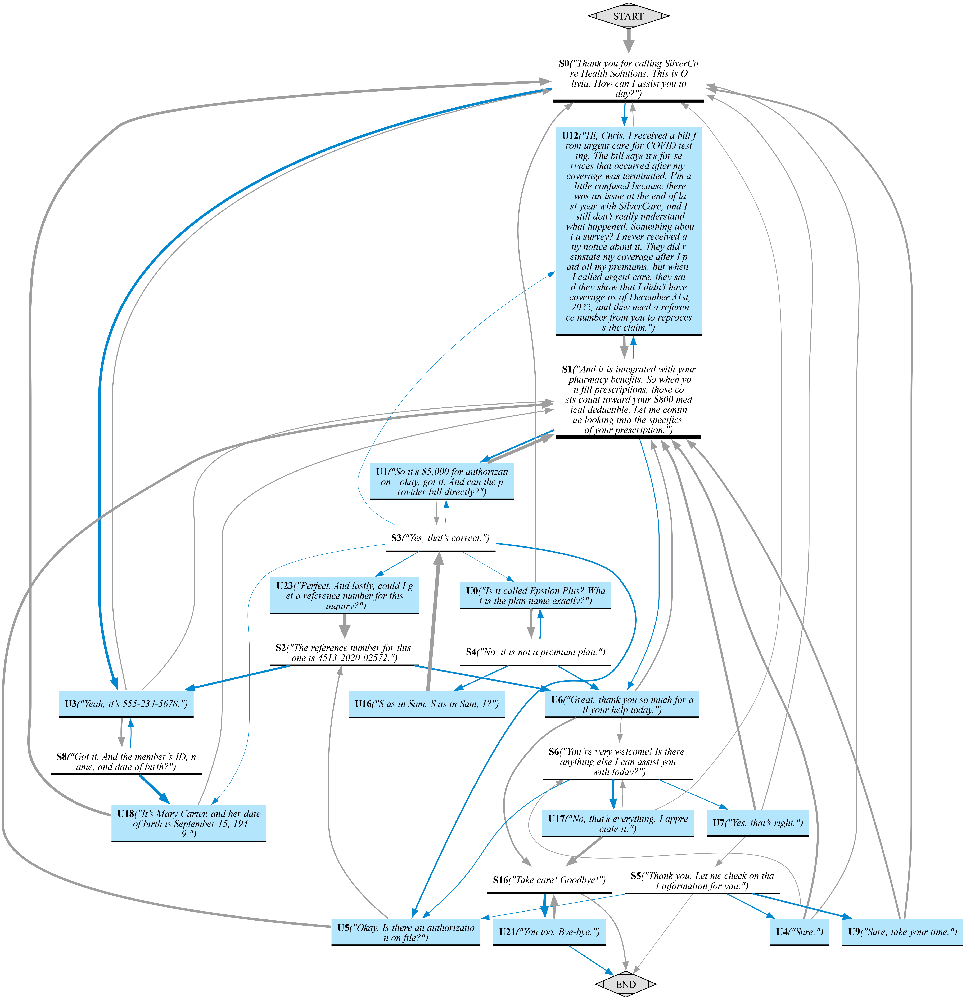
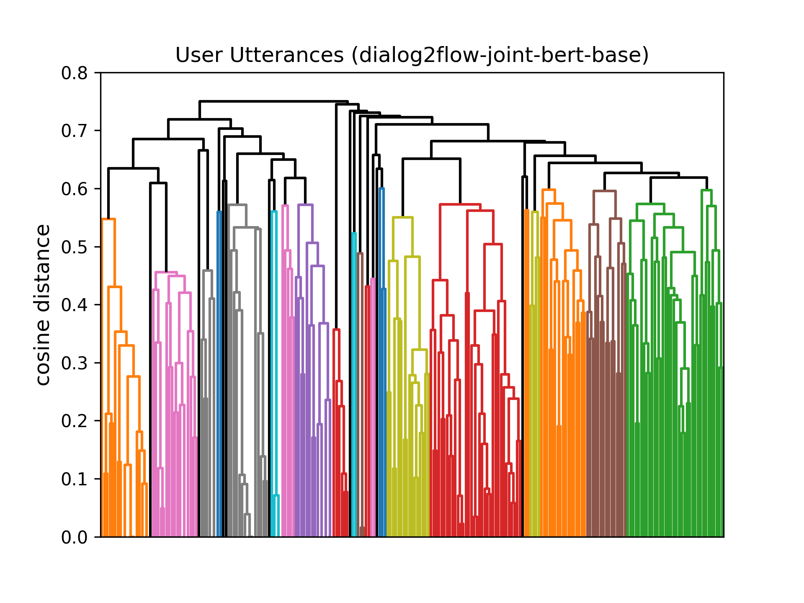

# :speech_balloon: **Dialog2Flow**: Convert Your Dialogs to Dialog Flows!

> This repository accompanies the paper ["Dialog2Flow: Pre-training Soft-Contrastive Sentence Embeddings for Automatic Dialog Flow Extraction"](https://arxiv.org/abs/2410.18481), accepted to the EMNLP 2024 main conference.  
> It contains code to replicate the experiments, train the models, and access released resources like the dataset:
> - **Experimentation:** To replicate the experiments and plots from our paper, see the [`PAPER.md`](PAPER.md) file.
> - **Models:** The models are available on Hugging Face as SentenceTransformer models [here](https://huggingface.co/collections/sergioburdisso/dialog2flow-67162ca33155cb90a533b7fa).
> - **Dataset:** The dataset is available on Hugging Face [here](https://huggingface.co/datasets/sergioburdisso/dialog2flow-dataset), or you can create it from scratch as described [here](train/#unified-tod-dataset).
> - **Training:** For details on training the models from scratch, see the [`train/`](train/) folder.

---

## How Does It Work?

It's simple!

**Input:** A collection of dialogues or conversations.  
**Output:** A step-by-step action transition graph!

### Input Example
In the [`data/example/`](data/example/) folder, you'll find 13 customer service conversations for a fictional health insurance company, *SilverCare Health Solutions*. These dialogues were generated using ChatGPT to demonstrate the process, but you can replace them with your own real-world conversations.

### Output Example
Using **Dialog2Flow**, these conversations are automatically converted into the following graph, which visually represents the common flow of interactions in this example set:



Additionally, **Dialog2Flow** generates a self-contained HTML file with an interactive visualization of the graph. You can explore the interactive version of the graph online [here](http://tworld.io/extra/dialog2flow_example/). Features include:
- Click to expand nodes.
- Double-click on a node to enter "navigation mode" for a step-by-step traversal.
- Click the blue arrow in the bottom-left corner to undo the last action.

Hovering over a node will display example utterances from the conversation collection that correspond to that step, providing context for how the dialogue flows.

## Can I Do It?

Certainly! You can generate the graph step-by-step using two Python scripts as described in Section 7 of our paper:

1. **`extract_trajectories.py`**: This script clusters utterance embeddings using Dialog2Flow embeddings to convert dialogues into trajectories of cluster IDs (discrete steps).
2. **`build_graph.py`**: This script combines the trajectories into a graph.

### Step-by-Step Example

1. **Convert the 13 dialogues into 13 trajectories:**
    ```bash
    python extract_trajectories.py -i data/example/ -o output/ -t 0.6
    ```
    Where:
    - `-i` is the path to the conversations.
    - `-o` is the path to store the trajectories.
    - `-t` sets the similarity threshold (0–1) for clustering. The lower the value, the more "steps" will be identified. In this example, we use `0.6`.

    This will generate a JSON file containing the 13 trajectories: `output/trajectories-dialog2flow-joint-bert-base.json`.

2. **Convert the 13 trajectories into an action transition graph:**
    ```bash
    python build_graph.py -i output/trajectories-dialog2flow-joint-bert-base.json \
                          -o output/graph/ \
                          -ew prob-out \
                          -te 0.1 \
                          -png \
                          -iv
    ```
    Where:
    - `-i` is the path to the JSON file with the trajectories.
    - `-o` is the output directory.
    - `-ew` specifies how to weight the edges (in this case, by transition probabilities).
    - `-te` sets the edge weight threshold. Edges with probabilities below `0.1` will be pruned.
    - `-png` generates a PNG image of the graph.
    - `-iv` generates an interactive HTML version of the graph.

By default, the nodes represent clusters of utterances, with the name of each step being a representative utterance from the cluster. If you open the generated PNG image (`output/graph/dialog2flow-joint-bert-base/graph.png`), you will see a graph like this:



### Add Names to the Steps
To generate names for the steps, we can use a generative model (e.g., GPT-4) to assign a name to each cluster of utterances. This process is detailed in Appendix G of the paper. 

To automatically generate names, use the `-l` argument in `extract_trajectories.py`:
```bash
python extract_trajectories.py -i data/example/ -o output/ -t 0.6 -l
python build_graph.py -i output/trajectories-dialog2flow-joint-bert-base.json \
                        -o output/graph/ \
                        -ew prob-out \
                        -te 0.1 \
                        -png \
                        -iv
```
Make sure to set your OpenAI API key in the environment variables before running these commands:
```bash
export OPENAI_API_KEY=<YOUR_API_KEY_HERE>
```
After running the commands, the new PNG graph (`output/graph/dialog2flow-joint-bert-base/graph.png`) will include meaningful step names as shown in the first graph :).

## Where Did That `-t 0.6` Come From? 

As described in Appendix F of the paper, determining the correct number of steps (clusters) is non-trivial. We use dendrogram plots to assist with this. To generate the dendrogram plots, add the `-sp` argument to the `extract_trajectories.py` script:
```
python extract_trajectories.py -i data/example/ -o output/ -t .6 -sp
```
The plots will be saved in the output/plots directory. For example, you can view the dendrogram for the user (customer) utterances in `output/plots/dendrogram_dialog2flow-joint-bert-base.user.png`:



The plot shows that a threshold of 0.6 seems appropriate, yielding over 20 clusters (steps). If you want to use a fixed number of clusters (e.g., 10 steps), specify the number instead of the threshold:
```
python extract_trajectories.py -i data/example/ -o output/ -t 10 -sp
```
This will result in a more simplified graph.


## Research Paper Resources

- **Experimentation:** To replicate the experiments and plots from our paper, see the [`PAPER.md`](PAPER.md) file.
- **Models:** The models are available on Hugging Face [here](https://huggingface.co/collections/sergioburdisso/dialog2flow-67162ca33155cb90a533b7fa).
- **Dataset:** The dataset is available on Hugging Face [here](https://huggingface.co/datasets/sergioburdisso/dialog2flow-dataset), or you can create it from scratch as described [here](train/#unified-tod-dataset).
- **Training:** For training the models from scratch, see the [`train/`](train/) folder for more details.


## Citation

If you found the paper and/or this repository useful, please consider citing our work: :blush::+1:

```bibtex
@inproceedings{burdisso-etal-2024-dialog2flow,
    title = "Dialog2Flow: Pre-training Soft-Contrastive Action-Driven Sentence Embeddings for Automatic Dialog Flow Extraction",
    author = "Burdisso, Sergio  and
      Madikeri, Srikanth  and
      Motlicek, Petr",
    booktitle = "Proceedings of the 2024 Conference on Empirical Methods in Natural Language Processing",
    month = nov,
    year = "2024",
    address = "Miami",
    publisher = "Association for Computational Linguistics",
}
```

## License

Copyright (c) 2024 [Idiap Research Institute](https://www.idiap.ch/).

MIT License.
